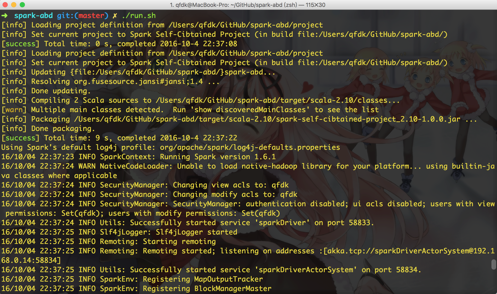

## Intro

```bash
├── CR.md
├── README.md
├── run.sh
├── install_spark.sh
├── bin
├── build.sbt
├── project
│   ├── plugins.sbt
│   ├── project
│   └── target
├── src
│   ├── main
│   └── test
└── target
    ├── resolution-cache
    ├── scala-2.10
    └── streams
```

## How to install Apache Spark and its env ?

with this script it will download a list of programme and put the schema in the $PATH

* Java 1.8
* Scala 2.10.6
* SBT
* Apache Spark 1.6.1

```bash
bash install_spark.sh
```

## How to execute the application Spark ?

```bash
bash run.sh
```

